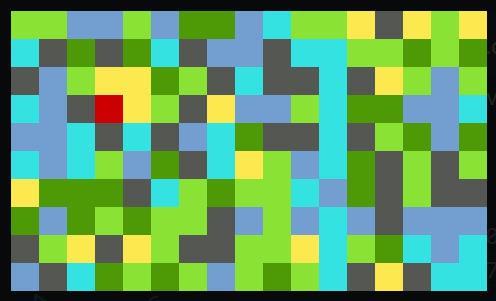

## Adventure!
This is a little project I've started April 2023.
It's a 'game' that's more going to be a bit of a tech demo - I want to try applying some of the data structures & algorithms I've learnt

### Objectives

- [x] create the basic structure of the game
- [x] get it to draw out the map in terminal (with fancy ANSI color stuff)
- [ ] get some actually nice terrain going w perlin noise
- [ ] create quests, inventory, location events
- [ ] create unfriendlies and pathfinding
- [ ] move the graphics to SplashKit bc printf
- [ ] success :)
